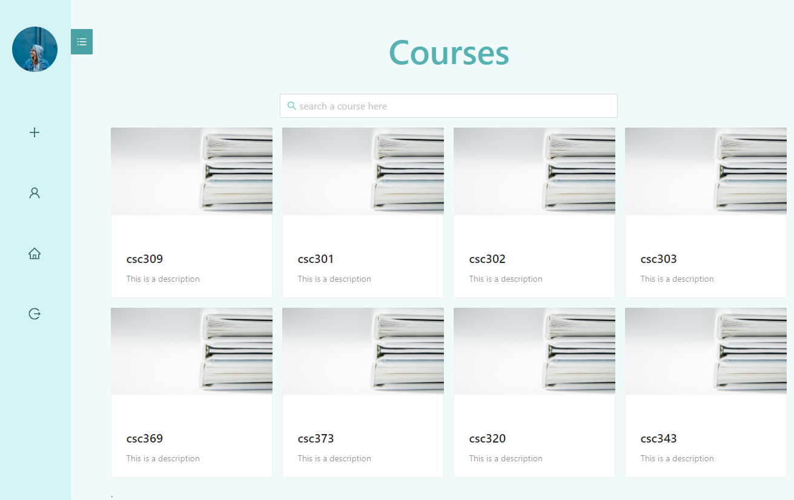
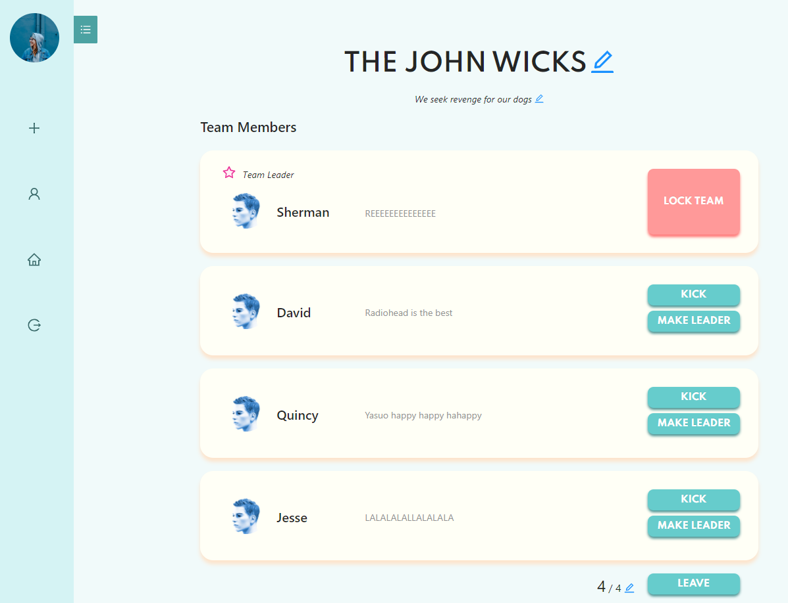
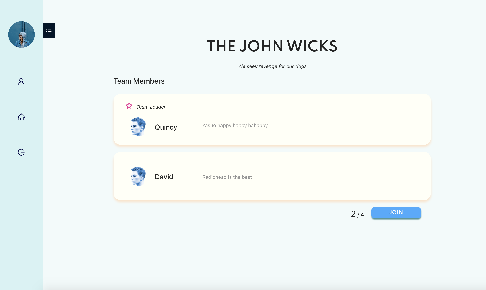
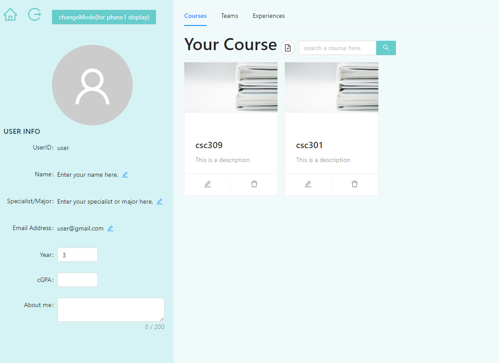
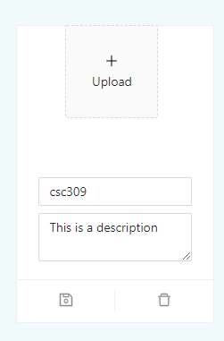
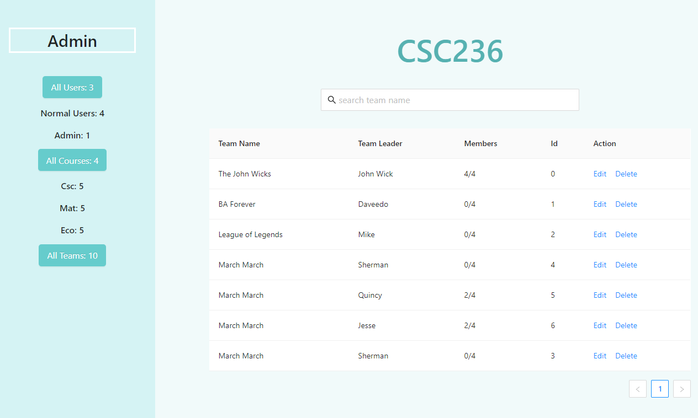
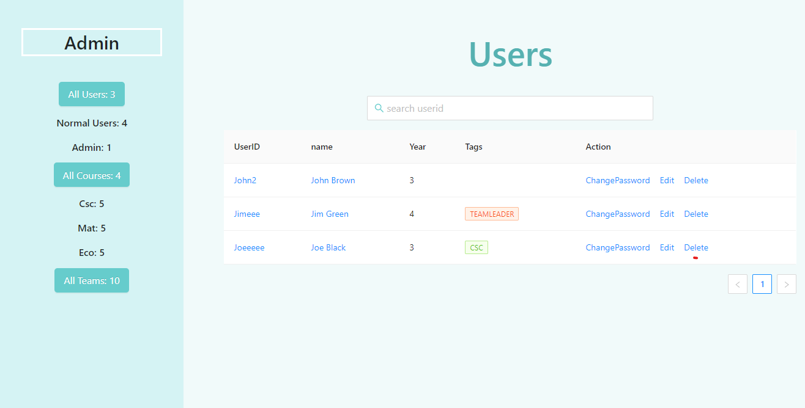

# team4

https://sleepy-ocean-40336.herokuapp.com/

>User Account: user/123456

>Admin Account: admin/adminadmin

This is a web app used to help users find teammates for their personal projects. The app will target primarily university students. University students can access the premade course teams created by the Admin, create their profiles, and search for their ideal teammates based on their profiles.

# Phase 1

### Data:

All data is hardcoded in the js files.

User Data should be pulled from server, but we hardcoded them in the state. 

### Sidebars:

Most pages have the same sidebar to keep a consistent layout. Since we are not dealing with the data transforming right now, all sidebars are hardcoded but will be dynamically changed depending on data in phase 2.

## Views:

### Login view, path:`/`

Login username and password:
For normal user: `user`/`user`
For Admin user: `admin`/`admin`

- All usernames are unique.
- All normal users can find their passwords by the `Don't remember the password` button (Admin cannot).
- Users can sign up by entering the username, password, and then click the `sign up` button

### Home View (User) path: `/Home`

- User can search for a particular course by using the search bar. The search result will be dynamically updated when use types.
- There are four buttons on the sidebar
  1. prompts a modal to create a team
  2. Navigates to the user's profile page
  3. Goes to the home page which is this page
  4. Log this user out, and goes to login page
- Click on any course go to the Team page where you can find a team and join them.

### Course View (User) path: `/Course`

- Teams of a particular course. E.g CSC236
- Each card represent a team, and their team logo and name are displayed on the card
- Each card can be clicked into so that a user can view or join a team if there is space

### Single Team View (Team Leader) path `/Team`

- Team Leader can lock the team, so that other user cannot join this team.
- Team Leader can kick any team member by clicking kick button.
- Team Leader cannot leave the team until he makes another member the new leader, or this team has no other team member.
- Team Leader can change the title and description of the team.

### (Team member view) same path

- Team member can leave the team by clicking leave button.

### (Team member view) same path

- Users not part of the team can join the team (if capacity allows) by clicking join button.

### (Profile Course View) Profile path: `/Profile`

These two pages are the first tab of the profile page. On the left hand side is the information bar displayed. UserId is fixed so users cannot change it. Users can change other informations as they want. Notice year and cGPA can only be numbers. The email address but inlcude '@' to be valid. The home button on the top left links to the home page. The button next to it indicates log out. The button 'changeMode for phase1 display' is only for phase displaying purpose. It will be deleted after phase1 finish. Clicking the button will change the current reader to a user other than the owner of the profile page. Hence the reader cannot modify the content of the profile page. By clicking the button again can change the reader back to the owner. On the right side, users can add his/her currently taking courses. The bottom two buttons can change the content of the course card. The image of the course card can be uploaded in phase2.

### (Profile Team View) same path

This tab is similar to the profile course page. Users can add and delete their current teams.

### (Profile Experiences View) same path

This tab displays the user's experiences. Only owner of the profile page can add experience. But, anyone can comment on the experience. And again, only owners can delete the existing comments.

## Admin Pages

> note that all data on the sidebar is hardcoded right now

### Admin (Home page) path: `/Admin`

- if you want to enter admin page by direct address, you will see this

  

- There are three buttons in the sidebar
  
  - Click first one will go to `/AdminUsers` page to show all users in the database
  - Click Second one will go to `/Admin` page to show all Courses that are open for teaming
  - The Third Button is unclickable, just a way to highlight
    - display the total number of teams in our database
  - All numbers will be dynamically changed when we have real data
  
- Admin can add new Course by clicking the small add button next to the title "Course"

- Admin can log out by clicking the Log out button at the bottom

- Each course card is editable
  - 
  - we can change the image of this course, title of this course, and description of this course.
  - Click the card will go to `\CourseAdmin` to see all the teams in this Course

### All teams of one Course, path: `/CourseAdmin `

- side bar is the same as usual, but the third button displays all the teams in this course
- Admin can search teams by name
- Admin can delete a team by clicking delete button
- Admin can edit a team by clicking Edit. This goes`teamAdmin` Page.

### Admin Team page path: `/teamAdmin`

- This page is very similar to Team page of the Team Leader except that we can kick team leader also.
- Before you kick the team leader, you have to pick a new team leader first.

### Admin Users page path: `AdminUsers`

- this page display all the users in our database
- admin can edit User's profile by clicking `edit`, and this will go to their profile page
- admin can delete a user from the database by clicking `delete`
- admin can change the user's password by clicking `ChangePassword `Button

## Third-party libraries used:

- Ant Design
- [react uuid](https://www.npmjs.com/package/react-uuid)
- [grommet icons](https://www.npmjs.com/package/grommet-icons)
- [react router](https://www.npmjs.com/package/react-router)
- [react-sky](https://github.com/lucagez/sky)
